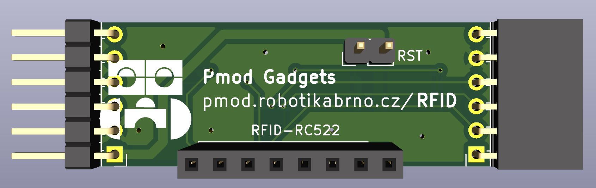
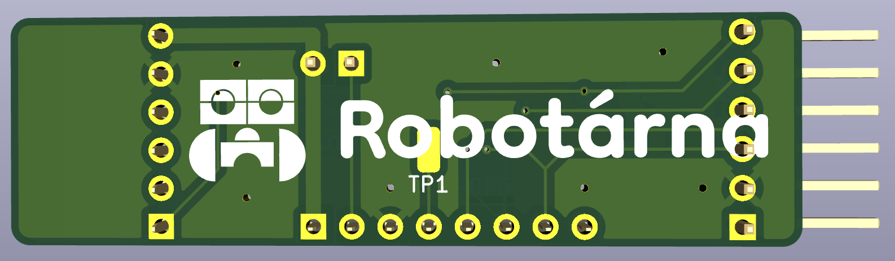

# Jak přidat další PMOD gadget

## Složky

V repozitáři `pmod` vytvoř si složku s názvem tvého gadgetu.
Tvůj název složky najdeš v tabulce s moduly v Google Dokumentech (viz Discord).
Název složky se bude shodovat s odkazem z webu: `https://pmod.robotikabrno.cz/RFID` (pro RFID modul je to `RFID`).

Požadovaná struktura je následující:
```bash
RB00-pmod-gadgets
├── pmod
│   ├── IR
│   │   ├── KiCad
│   │   │   ├── IR.kicad_pcb
│   │   │   ├── IR.kicad_pro
│   │   │   ├── IR.kicad_sch
│   │   ├── README.md
│   │   ├── assets
│   │   │   ├── default.png
│   │   │   ├── pcb.png
│   │   │   └── schema.png
│   │   └── manual.md
...
```

## Soubory
Zkopíruj si složku `template` v `pmod` a přejmenuj si jí pro tvůj gadget.

## KiCad
Vytvoř si složku `KiCad` pod svým gadgetem a do ní dej všechny soubory z KiCad projektu

## Dokumentace
V templatu jsou dva soubory `README.md` a `manual.md`.
Do `README.md` dejte popis co to je za modul, co děla, jak vypadá....
Do `manual.md` dejte návod na sestavení


## Navigace
Do `mkdocs.yml` úplně dole v sekci `nav` přidej název gadgety a umístění .md souborů.

## Obrázek
V adresáři gadgetu musí být adresář `assets`. Tam musí existovat obrázek `default.png`!!
Vytvořze si složku `assets-large`, tam dávejte velké fotky, automaticky se zmenší na vhodnou velikost pro zmenšení velikosti repozitáře. Automaticky se vloží do složky `assets`.

## Poznámky, varování...
[Odkaz na dokumentaci](https://squidfunk.github.io/mkdocs-material/reference/admonitions/#usage)

Pokud není něco jasné koukni se do `IR` modulu, nebo napiš na discord.

## Grafika

Pokud je to možné, tak na všechny PMOD moduly přidejte prosím tyto grafické prvky:

Přední část modulu:
- link na web (https://pmod.robotikabrno.cz/IR)
  - vaše URL se dozvíte v tabulce s moduly v Google Dokumentech (viz Discord)
  - font: Kicad
  - web netučně: pmod.robotikabrno.cz/
  - název modulu tučně: IR
  - celkově to vypadá takto: pmod.robotikabrno.cz/**IR**
- logo Robotika Brno (v `pmod/assets/robotarna.svg`)
- link na GitHub na modulu nebude, přidáme ho na web (link by byl dlouhej na malých destičkách)

Zadní část modulu:
- co se vejde to tam prosím dejte:
  - pokud se vejde, tak opakovat link na web (pmod.robotikabrno.cz/**IR**)
  - logo Robotika s textem Robotárna (v `pmod/assets/robotarna_full.svg`)


Ukázka grafiky na RFID modulu:
- velikost loga si upravte podle potřeby


